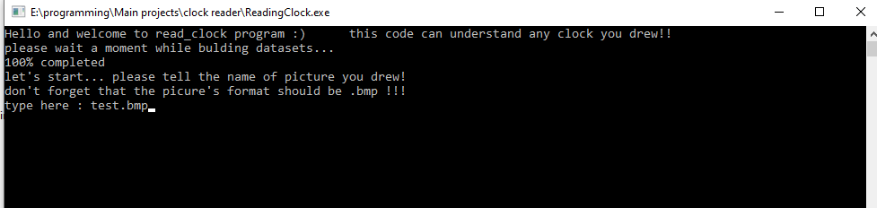
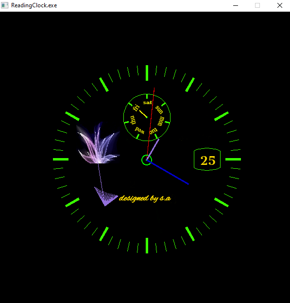

# ClockReader
* A programm that generates set of number's dataset from availible pre-painted images, then use a input.bmp file and read its context.
* This code uses allegro library for GUI part.
* You have to collect a dataset pack of numbers images for learning models.

as you can see below, there is the progress of generating dataset: 

So after completing this section, you can enter your file name and get output:

